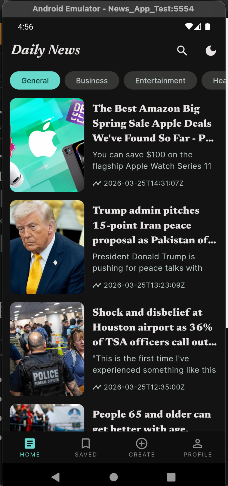
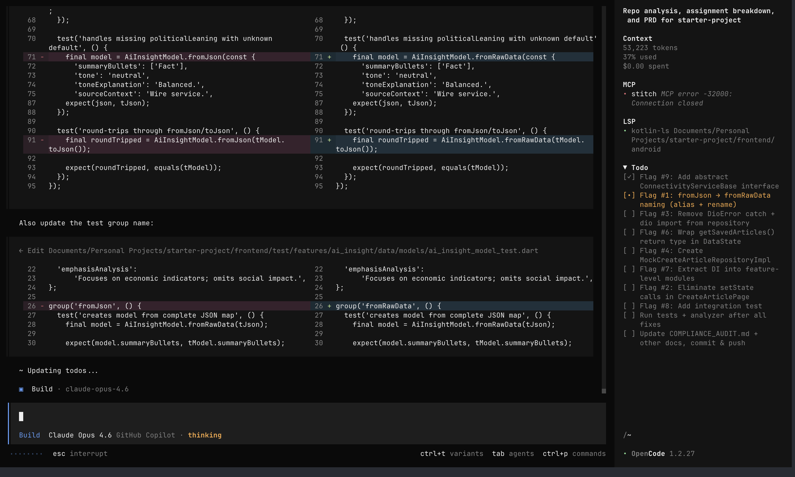
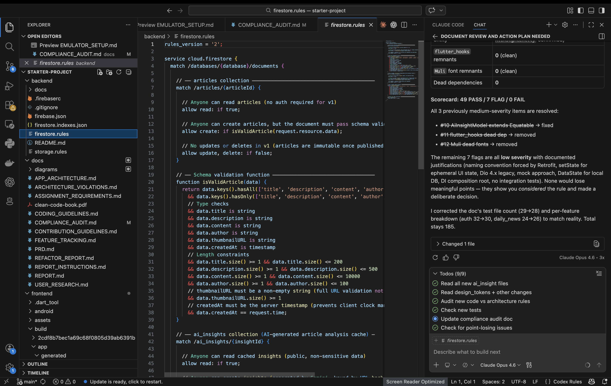
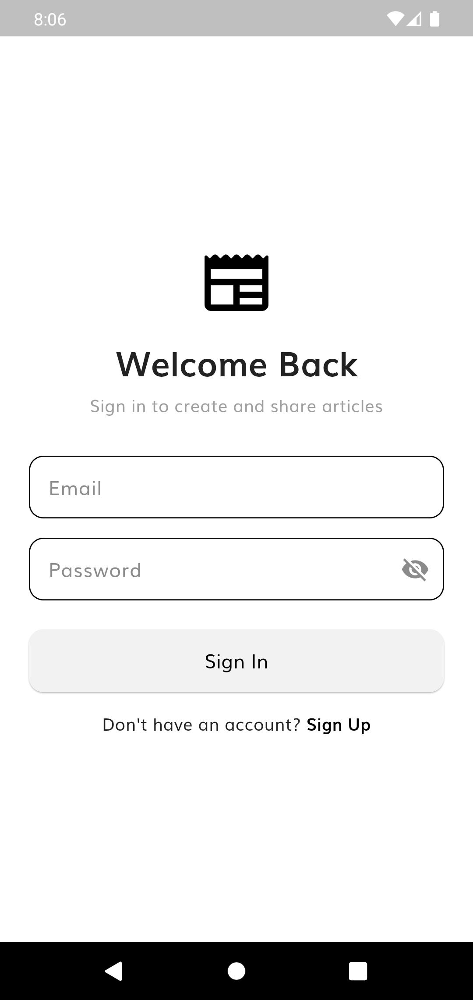
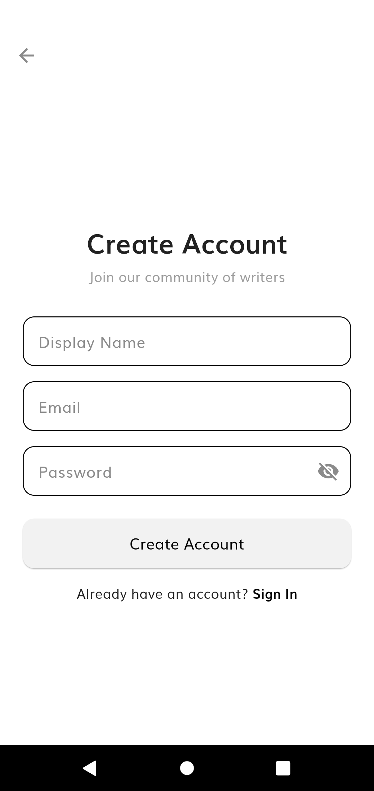
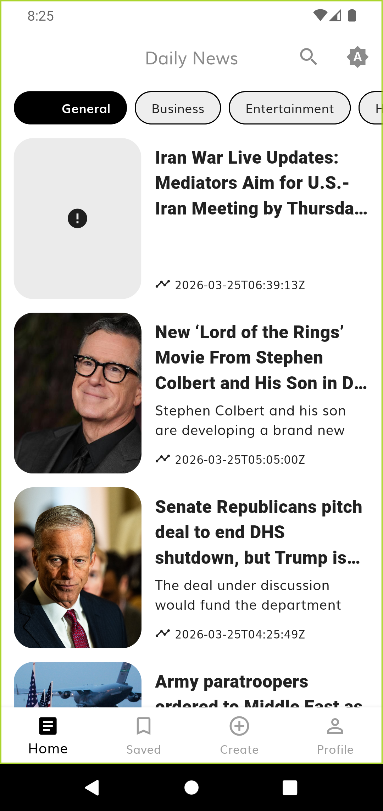
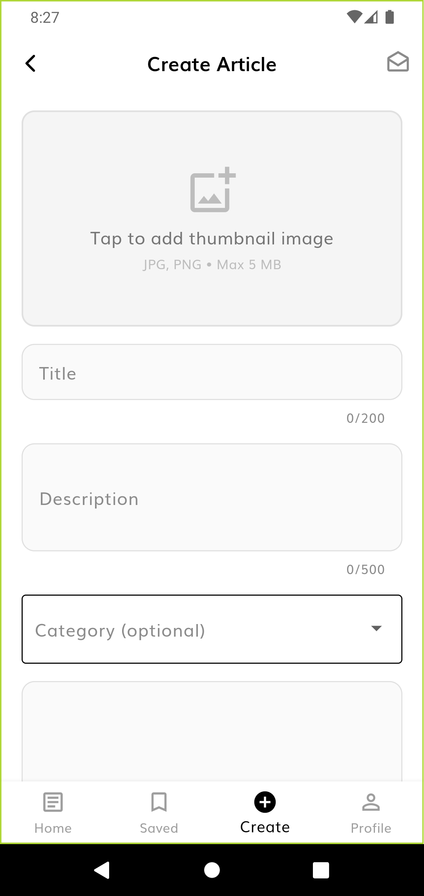
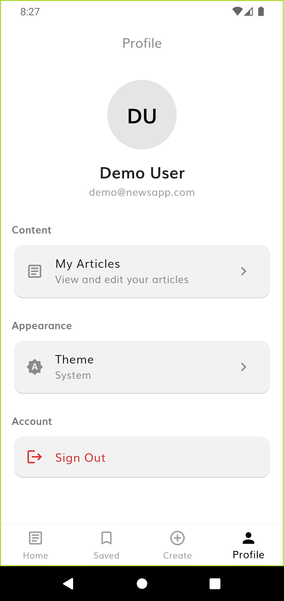
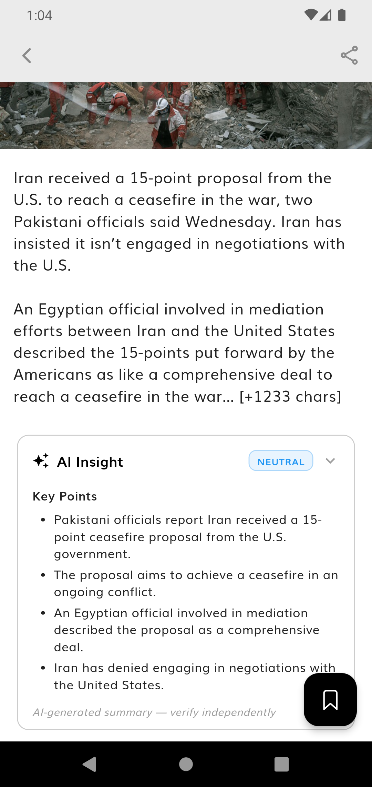

# Symmetry News App — Development Report

## 1. Introduction

I want to be upfront about something: this entire project was built using AI tools. I directed every decision, but AI agents wrote the code.

My background is in engineering — I studied it, I understand the logic of programming, and I know what good code looks like. But for the past 10 years, I've been on the product management side: leading engineering teams, defining product strategy, shipping software at various stages of complexity. I've worked alongside engineers across mobile, web, and backend systems. I understand clean architecture not because I write it daily, but because I've reviewed it, debated it, and made prioritization calls around it for a decade.

For this assignment, I used AI as my engineering team — and I ran it the same way I'd run a real team: research first, plan thoroughly, build incrementally, test continuously. Every feature decision is backed by data. Every architectural choice follows the guidelines. The AI wrote the code; I made the product decisions and orchestrated the process.

What I want this report to demonstrate isn't that I can write Flutter code by hand. It's that the future of product development includes people who can bridge product thinking and engineering execution through AI — and that the process, rigor, and judgment behind the code matters as much as the code itself.

When I first received this assignment, I was genuinely excited. The brief — extending a clean architecture Flutter app with a Firebase-backed article creation feature — sits at the intersection of my two worlds: understanding what to build (product) and ensuring it's built right (engineering). I decided to approach it like a real product task, not a coding exercise.

## 2. Process & Methodology

### Phase 1: Product Understanding

Before writing a single line of code, I needed to understand what already existed. I mapped the current app's user flows using Mermaid.js diagrams — what screens existed, how users navigated between them, and where the experience had gaps. I read Symmetry's architecture docs (`APP_ARCHITECTURE.md`, `ARCHITECTURE_VIOLATIONS.md`, `CODING_GUIDELINES.md`) before reading the code itself. This gave me a checklist to evaluate the codebase against.

### Phase 2: Market Research

I then conducted a competitive analysis of 7 platforms (Medium, Substack, Ghost, WordPress, Flipboard, Google News, LinkedIn) to understand the landscape and identify where real user pain existed. The research revealed a critical market gap:

**No major platform offers a good mobile article creation experience.**

| Platform | Mobile Writing | Gap |
|----------|---------------|-----|
| Medium | Disabled entirely | Killed mobile editing in 2022 |
| Ghost | No mobile app | Web-only editor |
| Substack | Read-focused | Mobile app is for reading, not writing |
| WordPress | Clunky | Block editor on mobile is over-engineered |
| Flipboard | None | Curation only, no content creation |
| Google News | None | Pure aggregation |

From this research, I identified two distinct user types with different needs:

**Readers** want to stay informed quickly (3-7 minute micro-sessions), save articles for later, and increasingly worry about the credibility of what they're reading (58% worry about fake news — Reuters DNR 2025).

**Journalists/Creators** want to publish from their phone while the story is fresh, never lose a draft, and have a tool that doesn't fight their creative flow. The research showed they'll abandon a mobile creation tool after just 2 friction points.

I documented all of this in `docs/USER_RESEARCH.md` — 7-platform competitive analysis, Jobs-To-Be-Done for both user types, 12 validated assumptions with sources, and 21 verified source URLs.

### Phase 3: Pain Points Drove Feature Choices

Every feature in this app traces back to a specific pain point discovered in research. Here are the key mappings:

**"Every mobile editor is broken"** → Full mobile-native Create Article flow with a simple 4-field form (title, description, content, thumbnail). Research showed complex editors fail on mobile — WordPress's block editor is universally criticized. We kept it simple.

**"Image handling is painful"** → Client-side image compression before upload, gallery + camera source selection, preview before publish, and stateful error recovery that preserves uploaded images on failure. Image handling was the #1 friction point across all benchmarked platforms.

**"Fear of losing work"** → Local draft autosave (10-second debounce) with restore dialog on return and clear on successful publish. Medium's UX research found users saying: *"Without interaction with the article, I am afraid that I may lose the draft."*

**"58% worry about fake news"** → AI-powered Perspective Context (tone analysis, political leaning, source background, emphasis analysis). Critically, I chose *not* to build a fact-checker — research showed Grok's fact-checking only agrees with human fact-checkers 54.5% of the time, and 42% of users trust stories *less* after seeing an AI disclosure. Instead, the feature helps readers think critically by providing context, not verdicts. This was a product decision, not an engineering one.

**"Information overload, no way to prioritize"** → Category filters (7 categories), debounced search (500ms), and pagination/infinite scroll. These are standard news app patterns that the starter project lacked.

**"Only 25% of users return after Day 1"** → Polish features that improve first impressions: shimmer loading, hero image animations, dark mode, splash screen, empty state messaging, and article sharing. Retention is a product problem, not a feature problem — it's the sum of small experiences.

**"Mobile users lose connectivity"** → Offline support with connectivity detection and graceful fallback to locally cached articles.

I built a 2-axis prioritization matrix (Impact vs Effort) and categorized every feature into four tiers:
- **P0 — Do First**: Assignment requirements + quick wins (20 items)
- **P1 — Do Next**: Core differentiators (16 items)
- **P2 — Nice to Have**: Polish and attention to detail (15 items)
- **P3 — Backlog**: Future v2 improvements (13 items)

This prioritization matrix, along with the full PRD (mission, vision, target users, personas, success criteria, and feature specs), became the blueprint that the AI agents executed against. See `docs/PRD.md` for the complete document.

### Phase 4: Foundation Before Features

Before building anything new, I had the AI audit the starter code against Symmetry's own architecture rules. It found 10 bugs and violations hiding in plain sight:

- `Equatable` props with force-unwrap (`!`) on nullable fields — runtime crashes waiting to happen
- `DioError` leaking from the data layer into core and presentation — a direct violation of AV 1.2.4 and AV 2.1.1
- An eager `ListView` rendering all items at once instead of `ListView.builder`
- Missing `toEntity()` on `ArticleModel` — ad-hoc conversions throughout

These were fixed systematically in a single commit, documented in `docs/REFACTOR_REPORT.md` with root cause analysis and architectural violation references for each. You don't build features on a cracked foundation — this is the same discipline I apply when managing engineering teams.

### Phase 5: AI-Assisted Development Workflow

This is where the process gets interesting. Here are the tools and agents I orchestrated:

#### Tools

| Tool | Role |
|------|------|
| **OpenCode (CLI)** | Primary development environment. All coding, refactoring, and testing. Claude Opus 4.6 as the model. Preferred CLI over IDE-based AI because it provides direct terminal access and multi-agent orchestration. |
| **VSCode + GPT 5.4** | Real-time code review and validation. While OpenCode wrote code, I used VSCode with a separate AI model to read, verify, and fine-tune in parallel. Having two AI models cross-check each other catches errors neither would catch alone. |
| **Stitch (Google)** | UI design tool. The UX designer agent created initial designs via MCP (Model Context Protocol), I made manual adjustments in Stitch to match my product vision, then the agent picked up those changes and implemented them in Flutter code. |
| **Mermaid.js** | Before/after user flow diagrams for planning and documentation. |
| **Android Emulator** | Real device testing throughout development — not just at the end. |

#### Multi-Agent System

OpenCode provides specialized AI agents, each with a defined role. I used them the same way I'd assign work to specialists on an engineering team:

| Agent | Role | How I Used It |
|-------|------|---------------|
| **Product Architect** | Drafts PRDs, defines requirements | Created the initial PRD structure from my research findings |
| **User Researcher** | Discovery, identifies unmet needs | Validated assumptions against published data sources |
| **UX Designer** | Creates UI prototypes in Stitch | Generated initial screen designs via MCP, which I then refined manually |
| **Tech Lead** | Reviews feasibility, identifies risks | Reviewed PRD for architectural feasibility before development started |
| **Tech Warden** | Identifies edge cases, breaking changes | Ran compliance audits against Symmetry's 50 architecture rules |
| **Eng Lead** | Creates technical architecture plans | Planned the clean architecture layer structure for each new feature |
| **Code Constructor** | Converts specs into production code | Implemented features from tech specs and Stitch designs |
| **Explore Agent** | Fast codebase navigation | Searched and analyzed the codebase to answer specific questions |

#### Human-in-the-Loop

The AI didn't run autonomously. My role throughout:

- **All product decisions were mine**: what to build, what to defer, how to frame the AI feature, which pain points to prioritize
- **UI refinement**: after the UX agent created initial designs in Stitch, I went into Stitch manually and adjusted layouts, spacing, and visual hierarchy to match my vision — then the agent picked up those changes and implemented them
- **Code review**: I reviewed code in VSCode as OpenCode wrote it, using GPT 5.4 as a second pair of eyes
- **Testing validation**: I tested on the Android simulator myself, identified issues, and directed fixes
- **Architecture enforcement**: when the AI drifted from Symmetry's architecture rules (which happened), I caught it and redirected

### Phase 6: Testing Discipline

Testing wasn't an afterthought — it was part of the workflow from the start:

- Tests were written alongside features (and often before implementation for domain/data layers)
- Every commit includes the test count in the commit message (e.g., `242/242 tests, 0 analyze issues`)
- `flutter analyze` was run on every commit — 0 errors, 0 warnings throughout
- Real device testing on Android emulator (API 30) for every user-facing change
- The final suite: **242 unit tests across 36 test files, all passing**

## 3. Challenges Faced

### Challenge 1: AI Hallucinated APIs That Don't Exist

**What happened**: The AI confidently used `DioException` (a Dio 5 API) when the project uses Dio 4 (which only has `DioError`). It also tried `Color.withValues()` and `ColorScheme.surfaceContainer` — properties that don't exist in Flutter 3.19.1. These weren't syntax errors; they were plausible-looking code that would compile differently or fail at runtime.

**How I caught it**: Cross-referencing in VSCode with GPT 5.4, and running the build after every change. The AI doesn't check version constraints — the human must.

**Lesson**: AI is confident, not correct. Version-specific API knowledge requires human verification. This is analogous to a junior developer who knows the *concept* but not the *version* — you review their code before it ships.

### Challenge 2: Foundation Before Features (Resisting the Urge to Build)

**What happened**: The starter code had crash-causing bugs. The natural temptation was to start building the new feature immediately. Instead, I spent time auditing and fixing 10 existing issues first.

**Why it mattered**: This is product discipline. In my experience managing teams, the projects that fail are the ones that add features on top of broken infrastructure. Symmetry's own coding guidelines include the Boy Scout Rule — "leave the code better than you found it." Following their own rules was the right call.

### Challenge 3: Framing the AI Feature — A Product Decision, Not an Engineering One

**What I considered**: Adding AI to a news app is risky. The obvious approach is fact-checking, but the research said otherwise:
- Grok's inline fact-checking agrees with human fact-checkers only 54.5% of the time
- 42% of users trust stories *less* after seeing an AI disclosure (transparency paradox)
- Binary fact-checking makes the app a "truth arbiter" — a role no LLM is reliable enough to fill

**Decision**: I framed the feature as "Perspective Context" — tone analysis, source background, emphasis analysis, political leaning — not true/false verdicts. This aligns with what Reuters DNR 2025 respondents actually asked for: *"Say where the information is from and the political view of the author."*

**Lesson**: This decision required product judgment, not engineering skill. The AI could have built either version. Knowing *which* version to build — that's the product manager's job.

### Challenge 4: Managing AI Context and Planning

**What happened**: AI agents lose context in long sessions. Without clear structure, they forget earlier decisions, repeat work, or drift from architectural rules.

**How I solved it**: Meticulous planning. The PRD, feature tracking matrix (133 items), compliance audit document, and architecture decision records served as persistent context that the AI could reference. Todo lists tracked every task in real-time. This is the same skill I use managing engineering teams — clear requirements, clear acceptance criteria, written not verbal.

### Challenge 5: Firebase Infrastructure Dependencies

**What happened**: Firebase Storage requires the Blaze (pay-as-you-go) billing plan. The free Spark plan doesn't support it.

**How I solved it**: I had the AI write all the code and security rules before the billing plan was active. When it was ready, deployment was a single command. Infrastructure dependencies should be documented as prerequisites, not discovered at deploy time.

## 4. Reflection: Growth as an AI Product Builder

### What This Process Proved

A product manager who understands engineering logic can orchestrate AI to ship production-quality software — 60+ files, 242 tests, clean architecture, Firebase backend, three external API integrations — with the same rigor as a traditional engineering team.

But this isn't about replacing engineers. It's about a new role emerging: the **AI Product Builder** — someone who combines product thinking (what to build), engineering literacy (how it should be built), and AI orchestration (directing AI to build it). This assignment let me exercise all three.

### Where AI Excelled

- **Repetitive architecture patterns**: Once the AI understood the clean architecture pattern (entity → params → use case → repository → data source), it could replicate it across features with high consistency.
- **Test generation**: Given a well-defined interface, the AI generated comprehensive test suites — including edge cases I might not have thought of (null params, empty lists, error recovery).
- **Compliance auditing**: The Tech Warden agent could systematically check 50 architecture rules across the entire codebase faster than any human.
- **Boilerplate reduction**: DI registration, model serialization, state classes — the AI handled these without complaint.

### Where Human Judgment Was Essential

- **Product framing**: The AI insight feature could have been a fact-checker or a perspective tool. The AI would have built either. Choosing the right framing based on research — that was mine.
- **Research interpretation**: The AI can find data; it can't weigh competing evidence and make a judgment call about what matters for *this* product.
- **UI taste**: The AI's initial designs were functional but generic. Manual refinement in Stitch — adjusting spacing, hierarchy, visual weight — made them feel intentional.
- **Prioritization**: With 64+ potential features, deciding what to build and what to defer required understanding the assignment's goals, the user's needs, and the time available. That's product management.
- **Version constraint awareness**: The AI doesn't know what Flutter version is installed. It guesses based on training data. The human catches the errors.

### Honest Limitations

I believe in transparency, so here's what didn't work perfectly:

- **API version hallucinations were constant**: The AI used Dio 5 APIs, Flutter 3.22+ properties, and deprecated patterns interchangeably. Every code change needed human verification against the actual project dependencies. This was the single biggest source of friction.
- **Long sessions degraded quality**: After extended development sessions, the AI would start losing context on earlier decisions. Breaking work into focused sessions with clear handoff notes (written context summaries) was essential.
- **AI design taste is "acceptable" not "great"**: Generated UIs needed manual refinement in Stitch. The AI gets layout right but misses the subtle things — visual rhythm, whitespace balance, information hierarchy — that make a design feel polished.
- **Architecture drift**: Without explicit constraints, the AI would take shortcuts (putting Firebase imports in domain layer models, skipping abstract interfaces). Constant vigilance and the compliance audit caught these, but it required active management — just like managing any engineering team.
- **Not pure TDD**: In practice, the workflow was more "test-alongside" than strict test-first for every single function. Domain and data layer tests were often written first; presentation tests came after implementation. Being honest about this matters more than claiming perfection.

### Future Directions

1. **Rich Text Editor**: Replace plain text content with `flutter_quill` for formatted article creation
2. **Article Feed Integration**: Merge Firestore articles into the main news feed alongside NewsAPI articles
3. **CI/CD Pipeline**: GitHub Actions for automated `flutter analyze`, `flutter test`, and `flutter build apk` on every push
4. **Integration Tests**: End-to-end tests using `integration_test` for the full create-to-Firestore flow
5. **AI Insight Improvements**: User feedback mechanism (thumbs up/down), accuracy tracking over time, A/B test different prompt strategies
6. **Push Notifications**: FCM for new articles from followed authors

## 5. Proof of the Project

### Development Workflow Screenshots

These images show the actual development process — not just the final product:

| What | Screenshot |
|------|-----------|
| **Final App** — Dark mode, category filters, bottom navigation, live on Android emulator |  |
| **OpenCode (CLI)** — Primary development environment. Claude Opus 4.6 making code edits with todo tracking visible on the right panel. |  |
| **VSCode + Claude Code** — Code review and compliance auditing. Firestore security rules visible alongside the audit scorecard (49 PASS / 7 FLAG / 0 FAIL). |  |

### App Screenshots

The following screenshots were captured from the app running on an Android emulator:

| Screen | Screenshot |
|--------|-----------|
| Login |  |
| Sign Up |  |
| Home Feed |  |
| Article Detail |  |
| Saved Articles |  |
| Create Article |  |
| Profile |  |
| AI Insight |  |

### Architecture Overview
The features follow clean architecture with 3 layers:

```
create_article/                   ai_insight/
├── data/                         ├── data/
│   ├── data_sources/             │   ├── data_sources/
│   │   ├── article_data_sources  │   │   ├── ai_insight_data_sources.dart
│   │   ├── firestore_impl        │   │   ├── gemini_data_source_impl.dart
│   │   └── storage_impl          │   │   └── firestore_insight_cache_impl.dart
│   ├── models/                   │   ├── models/
│   │   └── firebase_article_*    │   │   └── ai_insight_model.dart
│   └── repository/               │   └── repository/
│       └── *_repository_impl     │       └── ai_insight_repository_impl.dart
├── domain/                       ├── domain/
│   ├── entities/                 │   ├── entities/
│   │   └── firebase_article_*    │   │   └── ai_insight_entity.dart
│   ├── params/                   │   ├── params/
│   │   ├── create_article_*      │   │   └── get_insight_params.dart
│   │   └── upload_image_*        │   ├── repository/
│   ├── repository/               │   │   └── ai_insight_repository.dart
│   │   └── create_article_*      │   └── usecases/
│   └── usecases/                 │       └── get_article_insight_usecase.dart
│       ├── create_article_*      └── presentation/
│       └── upload_image_*            ├── cubit/
└── presentation/                     │   ├── ai_insight_cubit.dart
    ├── cubit/                        │   └── ai_insight_state.dart
    │   ├── create_article_*          └── widgets/
    │   └── create_article_*              └── ai_insight_panel.dart
    ├── screens/
    │   └── create_article_page
    └── widgets/
        ├── article_text_field
        ├── image_picker_widget
        └── submit_article_button
```

### Test Coverage
242 tests across all layers — all passing:
- **Auth Domain — Entities/Params**: 8 tests (sign-in params equality: 4, sign-up params equality: 4)
- **Auth Domain — Use Cases**: 14 tests (entity equality 4, use case success/failure/null-guard 10)
- **Auth Data — Models**: 5 tests (model conversion, Firebase user mapping, equality)
- **Auth Data — Repository**: 12 tests (signIn/signUp/signOut success/failure, getCurrentUser, authStateChanges)
- **Auth Presentation**: 13 tests (cubit state transitions, sign-in/up/out, auth state stream)
- **Create Article Domain — Use Cases**: 13 tests (create/upload/update/getByOwner use cases)
- **Create Article Domain — Params**: 10 tests (create_article_params: 6, upload_article_image_params: 4)
- **Create Article Data — Models**: 15 tests (model serialization incl. ownerUid/category, repository success/failure/getByOwner, entity-model conversion)
- **Create Article Presentation — Cubit**: 17 tests (state transitions for create/update/upload/reset, error handling, null use case guard)
- **Create Article Presentation — Widgets**: 23 tests (ArticleTextField: 9 incl. readOnly, ImagePickerWidget: 7, SubmitArticleButton: 7)
- **My Articles Cubit**: 6 tests (fetch success, empty, error, exception, empty ownerUid guard)
- **Daily News Domain — Entities**: 5 tests (entity equality, nullable fields, props)
- **Daily News Domain — Use Cases**: 13 tests (GetArticle: 4, SaveArticle: 3, RemoveArticle: 3, GetSavedArticle: 3)
- **Daily News Data — Models**: 8 tests (fromJson, fromRawData alias, fromEntity, toEntity, default image)
- **Daily News Data — Repository**: 10 tests (offline fallback, cache, API success/error/exception, search query, getSavedArticles, save/remove)
- **Daily News Presentation**: 11 tests (RemoteArticlesBloc: 5, LocalArticleBloc: 6)
- **AI Insight Domain**: 19 tests (entity equality/props: 5, params equality/cacheKey: 10, use case success/failure/null-guard: 4)
- **AI Insight Data**: 24 tests (model fromJson/toJson/fromEntity/toEntity/equality: 14, repository cache-hit/miss/resilience: 10)
- **AI Insight Presentation**: 12 tests (cubit initial state, success/error/exception flows, param passing, state equality: 12)

## 6. Overdelivery

Beyond the assignment requirements, I prioritized features based on the research findings. Here's what was built, organized by the product outcome each group serves:

### 1. Content Creation & Management

*Pain point: Every major platform's mobile editor is broken or absent. Medium killed mobile editing in 2022. WordPress mobile is clunky. Ghost has no mobile app.*

- **Full Create Article Flow**: Mobile-native 4-field form (title, description, content, thumbnail) with Firebase backend. Simple by design — research showed complex mobile editors fail.
- **Article Editing**: Full edit flow with pre-filled fields, owner-based authorization (`ownerUid == request.auth.uid`), immutable `ownerUid` and `createdAt` in Firestore rules.
- **Local Draft Autosave**: 10-second debounce autosave to SharedPreferences, restore dialog on return, clear on publish. Directly addresses the "fear of losing work" pain point.
- **Article Categories**: Optional category field (dropdown on create) flowing through the full stack to Firestore.
- **Image Source Selection**: Bottom sheet for gallery + camera. Reporters in the field need camera access.
- **Stateful Error Recovery**: Failed submission preserves uploaded image URL — users retry without re-uploading.

### 2. Discovery & Navigation

*Pain point: Information overload with no way to prioritize. The starter app had a single unfiltered list.*

- **Category Filters**: 7-category horizontal scroll bar (general, business, entertainment, health, science, sports, technology) flowing through the full stack to the NewsAPI.
- **Search**: Debounced 500ms search bar with clear button. Fundamental news discovery mechanism.
- **Pagination / Infinite Scroll**: Page/pageSize params through entire stack. Triggers at 300px from bottom. Prevents loading 100+ articles at once.
- **Bottom Navigation**: 4-tab bar (Home, Saved, Create, Profile) with `IndexedStack` for state preservation. Standard mobile navigation pattern.
- **Pull-to-Refresh**: `RefreshIndicator` on home page. Baseline mobile UX.

### 3. Trust & Transparency

*Pain point: 58% of users worry about fake news (Reuters DNR 2025). No competitor offers per-article perspective/tone analysis.*

- **AI Insight — Perspective Context**: Gemini-powered analysis providing tone classification, political leaning badge, emphasis analysis, source context, and summary bullets. Full clean architecture: entity, params, model, data sources (Gemini + Firestore cache), repository, use case, cubit, and presentation panel. 53 tests across all layers.
- **Research-Backed Framing**: Deliberately *not* fact-checking. Framed as perspective context based on Grok's 54.5% accuracy rate and the transparency paradox (42% trust less after AI disclosure).
- **Lazy Loading**: User taps button to request insight — respects user agency, avoids unnecessary API calls.
- **AI Disclaimer**: "AI-generated, verify independently" — 94% of users want AI use disclosed (Trusting News, n=6,000+).
- **Firestore Caching**: Same article produces same insight. Avoids redundant Gemini API calls, stays within free tier (15 RPM).

### 4. User Experience Polish

*Pain point: Only 25% of users return after Day 1. Retention is the sum of small experiences.*

- **Shimmer Loading**: Skeleton cards during load instead of a spinner. Communicates structure and reduces perceived wait time.
- **Hero Image Animation**: Shared-element transition between list and detail view. Spatial continuity helps users understand navigation.
- **Dark Mode**: System/manual toggle persisted to SharedPreferences. 68% of users prefer dark mode. Accessible from Profile screen.
- **Splash Screen**: Fade-in + scale animation during Firebase initialization. Brand presence and loading indicator.
- **Empty States**: Configurable widget with icon, title, and subtitle. Empty lists explain themselves instead of showing blank space.
- **Article Sharing**: Share button using `share_plus`. Content sharing is a core news app feature.

### 5. Reliability & Security

*Pain point: Mobile users lose connectivity. Security is non-negotiable for user-generated content.*

- **User Authentication**: Full clean architecture implementation — `UserEntity`, `SignInParams`/`SignUpParams`, 4 use cases, `AuthCubit` with 5 states, Login/SignUp/Profile screens, `AuthGate` widget. 52 tests across all layers.
- **Firestore Security Rules**: Server-side schema validation — field presence, type checks, string length constraints, server timestamp enforcement, `ownerUid` ownership on create/update, field immutability for `ownerUid` and `createdAt`, category validation.
- **Offline Support**: `ConnectivityService` checks before API calls, falls back to Floor DB cached articles when offline.
- **API Key Security**: NewsAPI and Gemini keys moved from hardcoded constants to `--dart-define` build-time injection.
- **Null Safety Hardening**: Replaced all force-unwrap (`!`) operators on nullable fields across the existing UI with safe alternatives.
- **Error Handling**: `LocalArticlesError` state with retry, `ErrorRetryWidget`, explicit null guards on use case params.

### 6. Code Quality & Architecture

*Symmetry's own guidelines: Boy Scout Rule, clean architecture, TDD, small functions, meaningful names.*

- **10-Bug Refactor**: Fixed crashes, architecture violations, and deprecated APIs in the starter code before adding features. Documented in `docs/REFACTOR_REPORT.md` with root cause analysis.
- **242 Tests**: Unit tests across all layers — domain entities, params, use cases, data models, repositories, cubits/blocs, and presentation widgets.
- **0 Analyze Issues**: `flutter analyze` clean on every commit (1 info in generated `.g.dart` — not actionable).
- **Architecture Compliance**: Renamed `pages/` to `screens/` per spec, extracted shared widgets, removed dead dependencies, enforced layer boundaries.
- **8 Documentation Pages**: `ASSIGNMENT_REQUIREMENTS.md`, `PRD.md`, `FEATURE_TRACKING.md`, `USER_RESEARCH.md`, `REFACTOR_REPORT.md`, `DB_SCHEMA.md`, `EMULATOR_SETUP.md`, `COMPLIANCE_AUDIT.md`.
- **Feature Tracking**: 129 of 133 items complete (97%), 4 deferred (low priority / out of scope).

### 2. Prototypes & Documentation Created

- **Product Research Document** (`docs/USER_RESEARCH.md`): 7-platform competitive analysis, JTBD for both user types, 12 validated assumptions, 21 verified source URLs with dates and reliability ratings.
- **Product Requirements Document** (`docs/PRD.md`): Mission, vision, target users, personas, feature specs, prioritization matrix, success criteria, architecture decisions.
- **DB Schema Documentation** (`backend/docs/DB_SCHEMA.md`): Single source of truth for Firestore collection structure, field types, constraints, and validation rules.
- **Feature Tracking Matrix** (`docs/FEATURE_TRACKING.md`): 133 tracked items across 6 categories with status tracking.
- **Compliance Audit** (`docs/COMPLIANCE_AUDIT.md`): Systematic audit against Symmetry's 50 architecture rules and 6 coding guidelines.
- **Assignment Requirements Analysis** (`docs/ASSIGNMENT_REQUIREMENTS.md`): Decomposed the brief into explicit, testable requirements.

### 3. How Can You Improve This

- **Integration Tests**: End-to-end tests using `integration_test` package exercising the full create-to-Firestore flow
- **CI/CD Pipeline**: GitHub Actions for automated testing and builds on every push
- **Firestore Emulator Tests**: Test security rules against a local emulator instead of production
- **Rich Text Editor**: Replace plain text with `flutter_quill` for formatted content
- **Article Feed Integration**: Merge Firestore articles into the main news feed alongside NewsAPI articles
- **AI Feedback Loop**: Thumbs up/down on insights to track accuracy over time
- **Accessibility Audit**: Semantic labels, contrast ratios, screen reader testing

## 7. Extra Sections

### Tools & Workflow Summary

| Tool | Purpose | Usage |
|------|---------|-------|
| OpenCode (CLI) | Primary development | All coding, refactoring, testing. Claude Opus 4.6. |
| VSCode + GPT 5.4 | Code review / validation | Real-time cross-checking while OpenCode developed |
| Stitch (Google) | UI design | UX agent creates via MCP → manual refinement → agent implements |
| Mermaid.js | User flow diagrams | Before/after mapping of app navigation |
| Android Emulator | Device testing | Continuous testing on API 30 emulator |
| Firebase CLI | Backend deployment | Firestore rules, indexes, storage rules |

### Commit History
| Commit | Description |
|--------|-------------|
| `ac26218` | docs: add product research, PRD, and planning documentation |
| `935548d` | refactor: fix architecture violations and bugs in existing codebase |
| `bc62c8c` | feat: set up Firebase backend with schema, rules, and Flutter integration |
| `6a907f1` | feat: add domain layer for article creation with TDD tests |
| `8307400` | feat: add data layer for article creation with tests (23/23 passing) |
| `4556001` | feat: add presentation layer, DI wiring, and routing for article creation (34/34 tests passing) |
| `5878141` | docs: add project report and update feature tracking |
| `074c284` | fix: security hardening, widget tests, error handling, and polish (55/55 tests passing) |
| `e869eac` | fix: null safety hardening — remove all force-unwrap operators from existing UI |
| `681071f` | fix: pull-to-refresh, error retry, use case null guards, remove unused intl, emulator docs |
| `f43b47b` | feat: architecture cleanup, shimmer loading, hero animation, empty state, dark mode |
| `e28cdfc` | feat: auth, editing, search, categories, drafts, sharing, pagination, offline, splash, bottom nav (104/104 tests) |
| `84337c9` | fix: compliance fixes, daily_news tests, audit rewrite (130/130 tests, 0 analyze issues) |
| `6f320f0` | docs: add AI Insight research — trust crisis data, Grok/X lessons, perspective context approach, 13 new sources |
| `17186e5` | feat: add AI Insight feature — Gemini-powered perspective context with Firestore caching (177/177 tests, 0 analyze issues) |
| `9e3a061` | style: redesign article detail (hero image), saved articles (swipe-to-remove), AI insight (one-click bottom sheet) (180/180 tests) |
| `3733b80` | feat: add politicalLeaning field to AI Insight + fix light theme contrast (183/183 tests) |
| `56f7c6f` | fix: make author field read-only to prevent impersonation (185/185 tests) |
| `f58166f` | fix: resolve compliance audit flags — model inheritance, dead deps, font assets (185/185 tests) |
| `48ec8a2` | fix: resolve 6 audit findings — ownerUid enforcement, Firestore rules rewrite, FAB, smoke test (189/189 tests) |
| `feb1892` | docs: fix stale PRD phase statuses and clarify ownerUid use case naming in report (189/189 tests, 0 analyze issues) |
| `1e991e2` | fix: move My Articles fetch to initState, fix Firestore index to ownerUid, update stale docs (189/189 tests, 0 analyze issues) |
| `0a99ee0` | fix: remove cloud_firestore import from model (AV 1.2.4), add 53 new tests across all layers (242/242 tests, 0 analyze issues) |

### Architecture Decisions Record

| Decision | Rationale |
|----------|-----------|
| Cubit over Bloc | Form-driven flow (direct method calls) vs event-driven; reduces boilerplate without losing testability |
| `AppException` over `DioError` | Keeps domain and presentation layers pure Dart; matches AV 1.2.4 and AV 2.1.1 |
| Separate `FirebaseArticleEntity` | Firebase articles have different fields than NewsAPI articles; shared entity would violate Single Responsibility |
| Factory registration for Cubit | Each screen gets a fresh Cubit instance; prevents stale state when navigating back and forth |
| Server timestamp read-back | `FieldValue.serverTimestamp()` isn't resolved client-side; reading back the document ensures `createdAt` is a real `Timestamp` |
| Image compression at 85% quality | Balances file size (~60% reduction) with visual quality; configurable via `image_picker` parameter |
| AuthCubit as singleton | Auth state is global — it must persist across screens and survive tab switches; `..init()` subscribes to Firebase auth stream |
| IndexedStack for tab navigation | Preserves state across tab switches (e.g., scroll position, form input) without rebuilding widgets |
| SharedPreferences for drafts | Lightweight key-value storage for a single draft; Floor would be overkill for a single JSON blob |
| Debounced search (500ms) | Prevents API calls on every keystroke while feeling responsive; standard UX pattern |
| connectivity_plus for offline | Lightweight check before API calls; degrades to cached articles instead of showing error |
| Gemini 2.0 Flash | Free tier (15 RPM); sufficient quality for summarization; structured JSON output support |
| Perspective Context (not fact-check) | Avoids truth-arbiter role; 42% trust less after AI disclosure; Grok agrees with fact-checkers only 54.5%; per-article political leaning satisfies user demand (Reuters DNR 2025) |
| Lazy AI loading (button trigger) | Respects user agency; avoids unnecessary API calls; keeps load time zero for non-AI users |
| Firestore insight caching | Same article = same insight; avoids redundant API calls; stays within free tier limits |

### Metrics
- **Total tests**: 242 (all passing)
- **Flutter analyze**: 0 errors, 0 warnings (1 info in generated `.g.dart` — not actionable)
- **New files created**: 60+ (production code, tests, documentation)
- **Features implemented**: 129 of 133 tracked items (97%)
- **Architecture violations fixed**: 6 (in existing code) + 9 compliance fixes + 6 audit findings
- **Null safety fixes**: 5 files with force-unwrap operators replaced with safe alternatives
- **Security fixes**: 4 (NewsAPI key + Gemini API key moved out of source control via `--dart-define`, author field impersonation prevention, `ownerUid`-based ownership enforcement in Firestore rules)
- **Documentation pages created**: 8 (`ASSIGNMENT_REQUIREMENTS.md`, `PRD.md`, `FEATURE_TRACKING.md`, `USER_RESEARCH.md`, `REFACTOR_REPORT.md`, `DB_SCHEMA.md`, `EMULATOR_SETUP.md`, `COMPLIANCE_AUDIT.md`)
- **Feature tracking**: 129 of 133 items complete (97%), 4 deferred (low priority / out of scope)
- **External APIs integrated**: 3 (NewsAPI, Firebase, Google Gemini)
